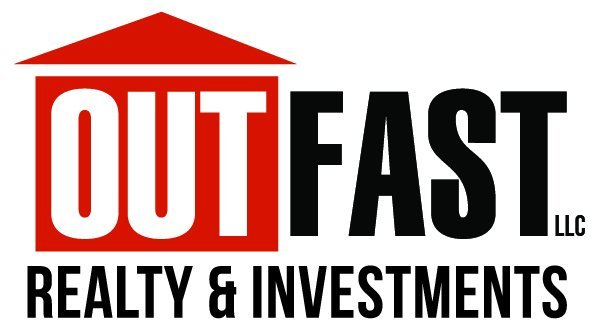
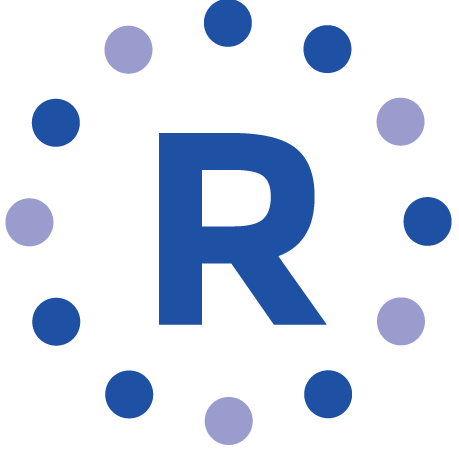

# BadIdeaHackathon2019  
Smart solutions to stupid ideas 

## Bad Idea Hackathon

Join Tampa Bay R Users for it's first ever Bad Idea Hackathon on December 7 at OutFast Realty! 

The Bad Idea Hackathon is an opportunity for members of the Tampa Bay R Users to get together and create something. Small teams or individuals will work together to create something bad in 8 hours. During that time we will have food, drinks and programming.

Please register [here](https://docs.google.com/forms/d/e/1FAIpQLSfUWhgdsU1vQHURq6RSzvIKqA2qEdcOL-zvnxZ2nRY90Xw2dw/viewform)!

## Info

:calendar: December 7

:clock10: 10 am to 6 pm

:office: OutFast Realty

:round_pushpin: [4023 N Armenia Ave Suite 220](https://www.google.com/maps/place/Out+Fast+Realty+%26+Investments/@27.9755655,-82.486562,17z/data=!3m1!4b1!4m5!3m4!1s0x88c2c38d167caf6b:0x8a69e2b5d9ccb257!8m2!3d27.9755655!4d-82.4843733) 

## What to bring 

- :smile: You
- :computer: Your laptop
- :bulb: An idea
- :pizza: :beer: Food and drinks

## Price 

Free! 

## Sponsors 

